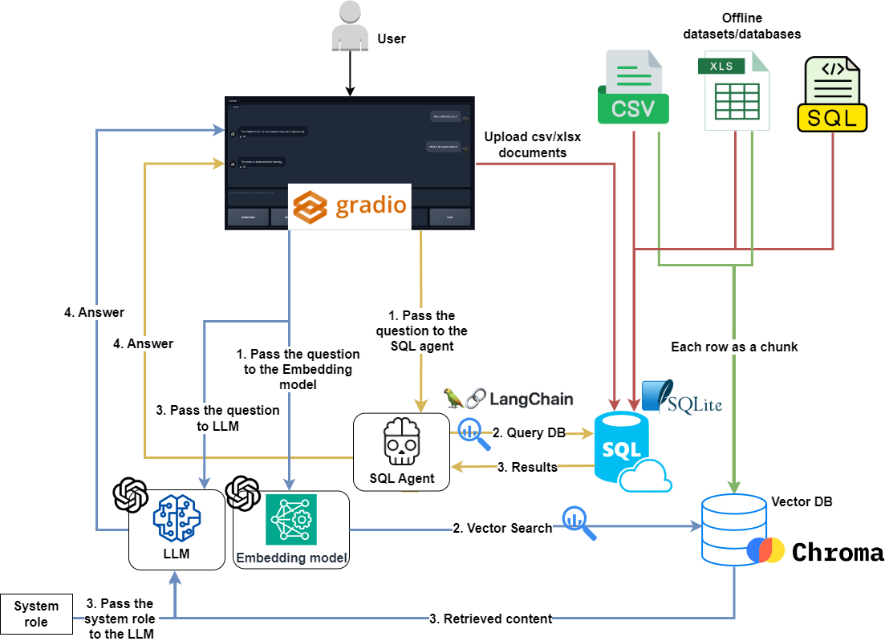
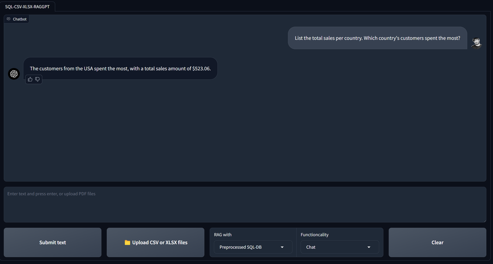

# Q&A-and-RAG-with-SQL-and-TabularData

`Q&A-and-RAG-with-SQL-and-TabularData` is a chatbot project that utilizes **GPT**, **LangChain**, **SQLite**, and **ChromaDB** and allows users to interact (perform **Q&A** and **RAG**) with SQL databases, CSV, and XLSX files using natural language.

**Key NOTE:** Remember to NOT use SQL databases with WRITE privileges. Use only READ permissions and limit the scope. Otherwise your user could manipulate the data (e.g., ask your chain to delete data).

## Features:
- Chat with SQL data
- Chat with preprocessed CSV and XLSX data
- Chat with uploaded CSV and XLSX files during interaction with the user interface
- RAG (Retrieval Augmented Generation) with tabular datasets

**YouTube video: [Link](https://youtu.be/ZtltjSjFPDg?si=0EomljP6HIEfCEwZ)** 

## Main underlying techniques used in this chatbot:
- LLM chains and agents
- GPT function calling
- Retrieval Augmented generation (RAG)

## Models used in this chatbot:
- OpenAI GPT models (GPT-4, GPT-3.5): [Website](https://platform.openai.com/docs/models)
- Compatible with GitHub Models and Azure OpenAI

## Requirements:
- Operating System: Linux, macOS, or Windows (WSL recommended for Windows)
- Python 3.8 or higher
- OpenAI API key, GitHub Models token, or Azure OpenAI credentials

## Installation:
Ensure you have Python installed along with required dependencies.

### For Linux/WSL:
```bash
sudo apt update && sudo apt upgrade
python3 -m venv venv
git clone https://github.com/TAHMID37/Agent-Database-Interaction.git
cd Agent-Database-Interaction
source venv/bin/activate
pip install -r requirements.txt
```

### For macOS:
```bash
python3 -m venv venv
git clone https://github.com/TAHMID37/Agent-Database-Interaction.git
cd Agent-Database-Interaction
source venv/bin/activate
pip install -r requirements.txt
```

### For Windows:
```bash
python -m venv venv
git clone https://github.com/TAHMID37/Agent-Database-Interaction.git
cd Agent-Database-Interaction
venv\Scripts\activate
pip install -r requirements.txt
```
## Execution:

### 1. Install SQLite (if not already installed)

#### Debian/Ubuntu (Linux)
```bash
sudo apt install sqlite3
```

#### macOS (Homebrew)
```bash
brew install sqlite
```

**Note:** macOS often already includes sqlite3 via system or Xcode command line tools.
Check if sqlite3 is available:
```bash
sqlite3 --version
```

#### Windows
Download from [SQLite Download Page](https://www.sqlite.org/download.html) or use a package manager like Chocolatey:
```bash
choco install sqlite
```

### 2. Prepare SQL DB from a `.sql` file

Copy your `.sql` file into the `data/sql` directory, then create the database:

```bash
sqlite3 data/sqldb.db
.read data/sql/<name_of_your_sql_database>.sql
```

Example:
```bash
.read data/sql/Chinook_Sqlite.sql
```

Verify the database was created successfully:
```sql
SELECT * FROM <TableName> LIMIT 10;
```

Example:
```sql
SELECT * FROM Artist LIMIT 10;
```

### 3. Prepare SQL DB from CSV and XLSX files

Copy your CSV/XLSX files to `data/csv_xlsx` directory, then run:

```bash
python src/prepare_csv_xlsx_sqlitedb.py
```

This creates a SQL database named `csv_xlsx_sqldb.db` in the `data` directory.

### 4. Prepare VectorDB from CSV and XLSX files

Copy your files to `data/for_upload` directory, then run:

```bash
python src/prepare_csv_xlsx_vectordb.py
```

This creates a VectorDB in the `data/chroma` directory.

### 5. Upload and chat with datasets via UI

To upload datasets and interact with them through the user interface:

1. Change the chat functionality to **Process files**
2. Upload your files and wait for confirmation that the database is ready
3. Switch the chat functionality back to **Chat**
4. Change the RAG dropdown to **Uploaded files**
5. Start chatting!

## Project Schema
<div align="center">
  
</div>

## Chatbot User Interface
<div align="center">
  
</div>

## Sample Datasets:
- **Titanic Dataset**: Included in `data/for_upload/titanic.csv`
- **Diabetes Dataset**: [Kaggle Link](https://www.kaggle.com/datasets/akshaydattatraykhare/diabetes-dataset?resource=download&select=diabetes.csv)
- **Cancer Dataset**: [Kaggle Link](https://www.kaggle.com/datasets/rohansahana/breast-cancer-dataset-for-beginners?select=train.csv)
- **Chinook Database**: [Sample SQL Database](https://database.guide/2-sample-databases-sqlite/)

## Key Frameworks/Libraries:
- **LangChain**: [Documentation](https://python.langchain.com/docs/get_started/introduction) - Framework for LLM applications
- **Gradio**: [Documentation](https://www.gradio.app/docs/interface) - Web UI framework
- **OpenAI**: [Developer Quickstart](https://platform.openai.com/docs/quickstart?context=python) - LLM API
- **SQLAlchemy**: [Documentation](https://www.sqlalchemy.org/) - SQL toolkit and ORM
- **ChromaDB**: [Documentation](https://www.trychroma.com/) - Vector database for embeddings

## Troubleshooting

### Common Issues:

1. **ImportError with LangChain modules**
   - The project has been updated to work with LangChain 1.0+
   - Imports now use `langchain_openai`, `langchain_community`, etc.
   - See notebooks in `explore/` for examples

2. **Missing dependencies**
   - Run `pip install -r requirements.txt` in your activated virtual environment
   - Optional dependencies like `chromadb` and `pyprojroot` are handled gracefully

3. **Column name mismatches in datasets**
   - The Titanic dataset uses `'Siblings/Spouses Aboard'` instead of `'SibSp'`
   - The code automatically adapts to different column naming conventions

4. **macOS sqlite3 issues**
   - macOS usually includes sqlite3, check with `sqlite3 --version`
   - If missing, install via Homebrew: `brew install sqlite`

## Contributing

Contributions are welcome! Please feel free to submit a Pull Request.

## License

This project is open source and available under the MIT License.
